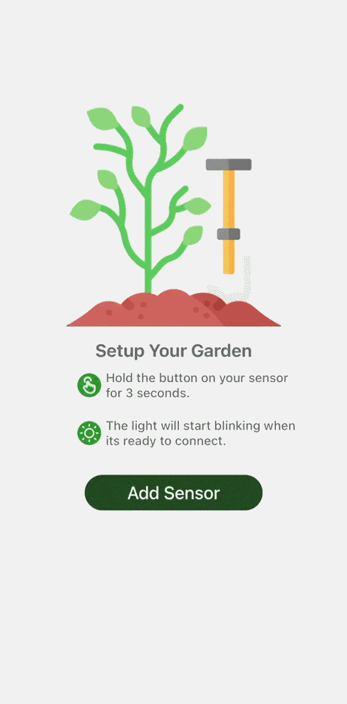
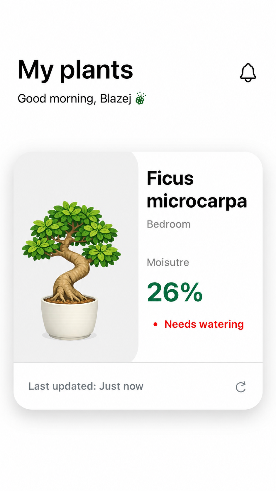
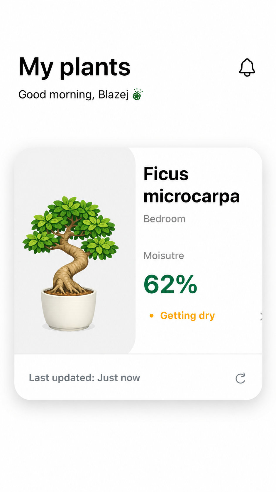
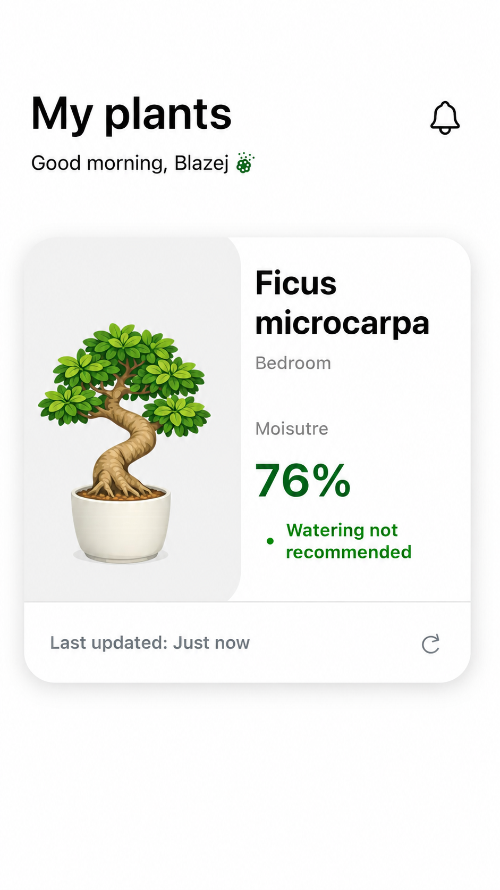
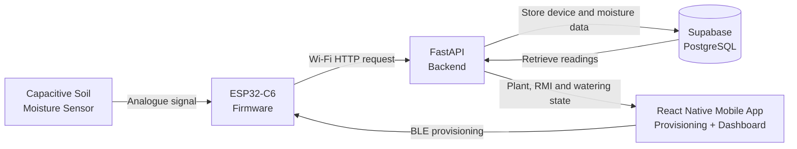

# IoT Plant Moisture Monitor

> An end-to-end IoT plant monitoring system combining ESP32-C6 firmware, Bluetooth and Wi-Fi provisioning, a React Native mobile application, a FastAPI backend, and PostgreSQL storage.

**Project status:** Completed MSc research prototype

---

## Overview

The **IoT Plant Moisture Monitor** is a full-stack embedded system designed to monitor root-zone moisture and support household plant-watering decisions.

A capacitive soil moisture sensor is connected to an ESP32-C6, which samples the sensor through its analogue-to-digital converter. A React Native mobile app discovers the device over Bluetooth Low Energy, transfers Wi-Fi credentials, and guides the user through setup and plant selection.

Once connected to Wi-Fi, the ESP32 converts the sensor response into a deployment-specific **Relative Moisture Index (RMI)** and sends both the raw averaged reading and RMI to a FastAPI backend. The backend stores device, plant, and moisture data in a Supabase-hosted PostgreSQL database and derives the watering state displayed by the mobile dashboard.

The project demonstrates integration across embedded firmware, BLE, Wi-Fi networking, mobile development, REST APIs, relational databases, and end-to-end IoT evaluation.

---

## Demonstration

### Hardware prototype

The prototype combines an **ESP32-C6 development board** with a **capacitive soil moisture sensor v2.0**.

The sensor uses three connections:

- `VCC` connects to the ESP32 `3V3` pin
- `GND` connects to the ESP32 ground
- `AOUT` connects to `GPIO4`, which is configured as an ADC input

For each observation, the ESP32 takes ten ADC samples at 50 ms intervals, averages them, and converts the result into the deployment-specific RMI.

<table>
  <tr>
    <td align="center" width="50%">
      <a href="https://github.com/user-attachments/assets/d5cf0176-1809-4835-9de0-a89056da859f">
        
      </a>
      <br />
      <sub>
        <strong>Bench prototype:</strong> ESP32-C6, breadboard, jumper wiring, button,
        and capacitive soil moisture sensor.
      </sub>
    </td>
    <td align="center" width="50%">
      <a href="https://github.com/user-attachments/assets/35517f52-1628-4a79-9233-ed0c922fa8bc">
        
      </a>
      <br />
      <sub>
        <strong>Live testing:</strong> the sensor inserted into the test plant
        while connected to the ESP32-C6.
      </sub>
    </td>
  </tr>
</table>

```text
Soil moisture
      ↓
Capacitive sensor
      ↓
Analogue voltage
      ↓
ESP32-C6 ADC
      ↓
Averaged raw reading
      ↓
Relative Moisture Index (RMI)
```

### Mobile provisioning flow

The mobile application provides a guided onboarding flow for connecting a new plant sensor.

The demonstration below shows:

1. Starting the sensor setup process via a 3-second button press
2. Searching for nearby ESP32 sensors over BLE
3. Discovering and connecting to the advertised device
4. Entering the local Wi-Fi details
5. Sending the credentials to the ESP32 over BLE
6. Monitoring the provisioning status
7. Confirming a successful Wi-Fi connection
8. Selecting the plant associated with the sensor
9. Opening the plant dashboard

<p align="center">
  
</p>

<p align="center">
  <sub>
    <strong>Mobile provisioning:</strong> BLE discovery, device connection,
    Wi-Fi configuration, plant selection, and successful setup.
  </sub>
</p>

Bluetooth is used only during onboarding. After receiving the Wi-Fi credentials and establishing a network connection, the ESP32 communicates directly with the backend over HTTP.

```text
React Native mobile app
        ↓ BLE discovery and connection
ESP32-C6
        ↓ BLE credential transfer
Wi-Fi connection
        ↓ HTTP
FastAPI backend
        ↓
Supabase PostgreSQL database
```

This avoids hard-coding Wi-Fi credentials into the firmware and gives the user a guided setup experience. In the current research prototype, credentials are not persisted across device restart, so provisioning must be repeated after power loss or restart.

### Mobile dashboard and watering states

The completed mobile dashboard displays the latest RMI together with a backend-derived watering state. Three fixed prototype states are used:

- `RMI ≤ 45` → **Needs watering**
- `45 < RMI < 65` → **Getting dry**
- `RMI ≥ 65` → **Watering not recommended**

<table>
  <tr>
    <td align="center" width="33%">
      
      <br />
      <sub><strong>Needs watering</strong></sub>
    </td>
    <td align="center" width="33%">
      
      <br />
      <sub><strong>Getting dry</strong></sub>
    </td>
    <td align="center" width="33%">
      
      <br />
      <sub><strong>Watering not recommended</strong></sub>
    </td>
  </tr>
</table>


### Moisture-reading demonstration

<p align="center">
  <a href="https://github.com/user-attachments/assets/fb9ae138-065b-4f63-bc9c-3486f3a75a67">
    
  </a>
</p>

<p align="center">
  <sub>
    <strong>Live sensor output:</strong> averaged ADC measurements and calculated
    Relative Moisture Index values produced by the ESP32 firmware.
  </sub>
</p>

The firmware samples the sensor ten times, calculates an average, and converts the result using fixed deployment-specific dry and wet reference values. Both the raw average and calculated RMI are then sent to the backend.

---

## Key Features

### Implemented

- ESP32-C6 firmware built with ESP-IDF and C
- Capacitive soil moisture sensor integration
- ADC measurements using ESP-IDF ADC oneshot mode
- Ten-sample averaging for each moisture observation
- Deployment-specific Relative Moisture Index (RMI)
- Bluetooth Low Energy advertising and discovery
- Custom BLE GATT service for provisioning
- Wi-Fi credentials transferred from the mobile app to the ESP32
- Provisioning status communication between the ESP32 and app
- React Native and Expo onboarding flow
- Plant selection and sensor-to-plant association
- Mobile dashboard showing the latest moisture reading and watering state
- Backend-derived `Needs watering`, `Getting dry`, and `Watering not recommended` states
- FastAPI REST API for device, plant, command, and moisture data
- SQLAlchemy integration with PostgreSQL
- Supabase storage for devices, plants, and moisture readings
- HTTP communication between the ESP32 and backend
- Development-only on-demand measurement pathway for end-to-end debugging

### Current limitations / future work

- Wi-Fi credentials are not persisted across restart
- FastAPI is currently accessed over the local network rather than a hosted cloud deployment
- The prototype uses USB power rather than a battery-powered enclosure
- Historical moisture charts and push notifications are not implemented
- Watering-state thresholds remain provisional rather than biologically validated
- Evaluation is limited to one plant, one sensor, and one watering cycle
- Multi-device/user support and device authentication remain future extensions

---

## System Architecture



### ESP32 firmware

The ESP32-C6 handles the embedded part of the system. It:

- Advertises as an available plant sensor over BLE
- Exposes a custom GATT provisioning service
- Receives Wi-Fi credentials from the mobile app
- Reports provisioning progress to the app
- Connects to the supplied Wi-Fi network
- Reads and averages the moisture sensor output
- Converts the raw measurement into the deployment-specific RMI
- Registers the device with the backend
- Sends raw and processed moisture readings to the API
- Polls the backend for development-only on-demand reading commands

The firmware uses NimBLE, FreeRTOS, ESP-IDF Wi-Fi APIs, the ADC oneshot driver, ESP HTTP Client, and cJSON.

### Mobile application

The mobile app is built with React Native, Expo, TypeScript, Expo Router, and `react-native-ble-plx`.

It handles BLE discovery and provisioning, plant selection, sensor association, location entry, and the final moisture dashboard. The dashboard retrieves the latest RMI and backend-derived watering state and presents the reading together with its age and plant information.

Because the project uses native BLE functionality, it requires an Expo development build rather than Expo Go.

### Backend and database

The FastAPI backend provides REST endpoints for the ESP32 and mobile application. It supports:

- Registering ESP32 devices
- Receiving moisture readings
- Retrieving available plant profiles
- Associating a plant with the deployed sensor
- Storing the plant location
- Returning dashboard data and the derived watering state
- Supporting the development-only on-demand reading command pathway

Supabase provides the hosted PostgreSQL database for devices, plants, time-stamped moisture readings, and development commands.

---

## Moisture Sensing and Calibration

The capacitive sensor outputs an analogue signal that changes with the moisture surrounding the probe.

For each observation, the firmware takes ten ADC samples at 50 ms intervals and calculates their mean before applying the RMI transformation.

The final deployment-specific reference values are:

```text
Dry reference: 2400 ADC
Wet reference: 800 ADC
```

The sensor produces lower ADC readings as moisture increases:

```text
Higher ADC reading = drier growing medium
Lower ADC reading  = wetter growing medium
```

The resulting RMI is interpreted as:

```text
0%   = local dry reference
100% = local very-wet reference
```

This is a **deployment-specific relative moisture index**, not an exact volumetric water-content measurement. Its purpose is to track moisture change within the fixed sensor and growing-medium deployment rather than provide a universally transferable soil-moisture percentage.

---

## Evaluation Summary

The completed prototype was evaluated using a single indoor *Ficus microcarpa* deployment, including repeated calibration measurements, a controlled 100 mL watering event, and 58 hours of subsequent natural dry-down monitoring.

- Mean RMI increased from **24.0% before watering** to **88.2% immediately afterwards**.
- During the hourly dry-down, RMI decreased from approximately **76% to 61%**.
- Elapsed time and RMI showed a strong negative monotonic association (`Spearman's ρ = -0.948`, `n = 58`, `p < 0.001`).
- All **58 scheduled hourly dry-down observations** were retained without identified missing measurements, duplicate timestamps, or unexpected gaps.

The evaluation therefore showed that the deployment-specific RMI could detect the watering event and track subsequent drying while the complete IoT pathway preserved and presented the required measurements. The findings remain bounded to the tested plant, sensor, and watering cycle.

---

## Technology Stack

| Area | Technologies |
|---|---|
| Firmware | ESP32-C6, ESP-IDF, C, NimBLE, FreeRTOS, ESP HTTP Client, cJSON |
| Mobile | React Native, Expo, TypeScript, Expo Router, `react-native-ble-plx` |
| Backend | Python, FastAPI, SQLAlchemy, Pydantic, Uvicorn |
| Database | PostgreSQL, Supabase |
| Development | Git, GitHub, VS Code, Xcode, ESP-IDF tools |

---

## Repository Structure

```text
.
├── app/                         # React Native and Expo application screens
│   └── (setup)/                 # Device onboarding and provisioning screens
│
├── assets/                      # Mobile application images and assets
│
├── components/                  # Reusable React Native UI components
│
├── features/
│   ├── plants/                  # Plant API services and related logic
│   └── provisioning/            # BLE discovery and provisioning logic
│
├── backend/                     # FastAPI backend application
│   ├── main.py                  # API routes, models, and schemas
│   └── .env.example             # Example environment configuration
│
├── hardware/
│   └── sample_project/          # ESP32-C6 ESP-IDF firmware
│       └── main/
│           ├── main.c           # Firmware entry point
│           ├── src/             # Firmware source files
│           └── include/         # Firmware header files
│
├── docs/
│   └── media/                   # README images, diagrams, and GIFs
│
├── package.json                 # Mobile dependencies and scripts
└── README.md
```

---

## Project Status

The MSc research prototype is complete and establishes the full implemented pathway:

```text
BLE provisioning
        ↓
Wi-Fi connection
        ↓
Moisture sensing + RMI
        ↓
FastAPI upload
        ↓
PostgreSQL storage
        ↓
Backend watering-state interpretation
        ↓
React Native dashboard
```

Future work would focus on repeated evaluation across additional watering cycles and deployments, stronger validation of the watering-state thresholds, battery-powered operation, credential persistence, cloud hosting, authentication, and multi-device support.

---

## What This Project Demonstrates

This project combines a physical sensor, embedded firmware, Bluetooth provisioning, Wi-Fi communication, a mobile application, a REST API, and cloud-hosted relational storage.

It demonstrates the design, implementation, and evaluation of a complete IoT system across hardware, firmware, networking, backend, database, and mobile layers, with a deployment-specific relative moisture model used to turn low-cost sensor readings into simple watering guidance.
