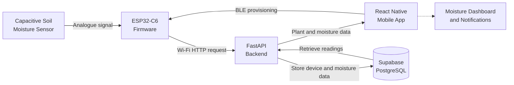

# IoT Plant Moisture Monitor

> An end-to-end IoT plant monitoring system combining ESP32-C6 firmware, Bluetooth and Wi-Fi provisioning, a React Native mobile application, a FastAPI backend, and PostgreSQL storage.

**Project status:** Active development

---

## Overview

The **IoT Plant Moisture Monitor** is a full-stack embedded system designed to measure soil moisture and support smarter plant-care decisions.

A capacitive soil moisture sensor is connected to an ESP32-C6, which samples the sensor through its analogue-to-digital converter. A React Native mobile app discovers the device over Bluetooth Low Energy and guides the user through plant selection and Wi-Fi provisioning.

Once connected to Wi-Fi, the ESP32 calculates a calibrated relative moisture percentage and sends the reading to a FastAPI backend. The backend stores device, plant, and moisture data in a Supabase PostgreSQL database.

The project demonstrates integration across embedded firmware, BLE, Wi-Fi networking, mobile development, REST APIs, and relational databases.

---

## Demonstration

### Hardware prototype

The current prototype combines an **ESP32-C6 development board** with a **capacitive soil moisture sensor v2.0**.

The sensor uses three connections:

- `VCC` connects to the ESP32 `3V3` pin
- `GND` connects to the ESP32 ground
- `AOUT` connects to `GPIO4`, which is configured as an ADC input

The ESP32 samples the analogue output, averages multiple readings to reduce noise, and converts the result into a relative moisture percentage.

<table>
  <tr>
    <td align="center" width="50%">
      <a href="https://github.com/user-attachments/assets/d5cf0176-1809-4835-9de0-a89056da859f">
        
      </a>
      <br />
      <sub>
        <strong>Bench prototype:</strong> ESP32-C6, breadboard, jumper wiring,
        and capacitive soil moisture sensor.
      </sub>
    </td>
    <td align="center" width="50%">
      <a href="https://github.com/user-attachments/assets/35517f52-1628-4a79-9233-ed0c922fa8bc">
        
      </a>
      <br />
      <sub>
        <strong>Live testing:</strong> the sensor inserted into the test plant
        while connected to the ESP32-C6.
      </sub>
    </td>
  </tr>
</table>

```text
Soil moisture
      ↓
Capacitive sensor
      ↓
Analogue voltage
      ↓
ESP32-C6 ADC
      ↓
Averaged raw reading
      ↓
Relative moisture percentage
```

### Mobile provisioning flow

The mobile application provides a guided onboarding flow for connecting a new plant sensor.

The demonstration below shows:

1. Starting the sensor setup process
2. Searching for nearby ESP32 sensors over BLE
3. Discovering and connecting to the advertised device
4. Entering the local Wi-Fi details
5. Sending the credentials to the ESP32 over BLE
6. Monitoring the provisioning status
7. Confirming a successful Wi-Fi connection
8. Selecting the plant associated with the sensor

<p align="center">
  <a href="https://github.com/user-attachments/assets/c6be969f-5e98-4492-8fec-fccb8d43c116">
    
  </a>
</p>

<p align="center">
  <sub>
    <strong>Mobile provisioning:</strong> BLE discovery, device connection,
    Wi-Fi configuration, plant selection, and successful setup.
  </sub>
</p>

Bluetooth is used during the initial setup process. After receiving the Wi-Fi credentials, the ESP32 can communicate directly with the backend over HTTP.

```text
React Native mobile app
        ↓ BLE discovery and connection
ESP32-C6
        ↓ BLE credential transfer
Wi-Fi connection
        ↓ HTTP
FastAPI backend
        ↓
Supabase PostgreSQL database
```

This removes the need to hard-code Wi-Fi credentials into the firmware and gives the user a guided setup experience.

### Moisture-reading demonstration

<p align="center">
  <a href="https://github.com/user-attachments/assets/fb9ae138-065b-4f63-bc9c-3486f3a75a67">
    
  </a>
</p>

<p align="center">
  <sub>
    <strong>Live sensor output:</strong> averaged ADC measurements and calculated
    relative moisture percentages produced by the ESP32 firmware.
  </sub>
</p>

The firmware samples the sensor several times, calculates an average, and converts the result using calibrated dry and wet reference values. Both the raw average and calculated percentage can then be sent to the backend.

---

## Key Features

### Currently implemented

- ESP32-C6 firmware built with ESP-IDF and C
- Capacitive soil moisture sensor integration
- ADC measurements using ESP-IDF ADC oneshot mode
- Averaging of multiple sensor samples
- Conversion from raw readings to relative moisture percentage
- Bluetooth Low Energy advertising and discovery
- Custom BLE GATT service for provisioning
- Wi-Fi credentials transferred from the mobile app to the ESP32
- Provisioning status communication between the ESP32 and app
- React Native and Expo onboarding flow
- FastAPI REST API for device and moisture data
- SQLAlchemy integration with PostgreSQL
- Supabase storage for devices, plants, and moisture readings
- HTTP communication between the ESP32 and backend

### Planned features

- Mobile dashboard showing current plant moisture
- Historical moisture charts
- Plant-specific moisture thresholds
- Watering recommendations
- Push notifications when a plant needs attention
- Improved plant-to-sensor linking
- Wi-Fi credential persistence using ESP32 NVS
- Deep-sleep support for lower power consumption
- Improved provisioning retries and error handling
- Hosted FastAPI deployment
- Device authentication and API security improvements
- Support for multiple plant sensors

---

## System Architecture



### ESP32 firmware

The ESP32-C6 handles the embedded part of the system. It:

- Advertises as an available plant sensor over BLE
- Exposes a custom GATT provisioning service
- Receives Wi-Fi credentials from the mobile app
- Connects to the selected Wi-Fi network
- Reads and processes the moisture sensor output
- Registers the device with the backend
- Sends moisture readings to the API
- Reports provisioning progress to the app

The firmware uses NimBLE, FreeRTOS, ESP-IDF Wi-Fi APIs, the ADC oneshot driver, ESP HTTP Client, and cJSON.

### Mobile application

The mobile app is built with React Native, Expo, TypeScript, Expo Router, and `react-native-ble-plx`.

It currently handles BLE discovery and device provisioning. Future development will focus on displaying current moisture, reading history, plant status, and watering alerts.

Because the project uses native BLE functionality, it requires an Expo development build rather than Expo Go.

### Backend and database

The FastAPI backend provides REST endpoints for the ESP32 and mobile application. It currently supports:

- Registering ESP32 devices
- Checking whether a device already exists
- Receiving moisture readings
- Associating readings with a device
- Retrieving plant information
- Storing data through SQLAlchemy

Supabase provides the hosted PostgreSQL database for devices, plants, and time-stamped moisture readings.

---

## Moisture Sensing and Calibration

The capacitive sensor outputs an analogue voltage that changes with the surrounding soil moisture.

To reduce measurement noise, the firmware takes several ADC samples and calculates their average.

The current approximate calibration values are:

```text
Dry reference: 2400
Wet reference: 1100
```

The sensor produces lower ADC readings as moisture increases:

```text
Higher ADC reading = drier soil
Lower ADC reading  = wetter soil
```

The resulting percentage is interpreted as:

```text
0%   = dry calibration point
100% = wet calibration point after watering and drainage
```

This is a **relative moisture index**, not an exact volumetric water-content measurement. The raw values can vary depending on soil composition, sensor placement, salinity, temperature, and individual sensor characteristics.

---

## Technology Stack

| Area | Technologies |
|---|---|
| Firmware | ESP32-C6, ESP-IDF, C, NimBLE, FreeRTOS, ESP HTTP Client, cJSON |
| Mobile | React Native, Expo, TypeScript, Expo Router, `react-native-ble-plx` |
| Backend | Python, FastAPI, SQLAlchemy, Pydantic, Uvicorn |
| Database | PostgreSQL, Supabase |
| Development | Git, GitHub, VS Code, Xcode, ESP-IDF tools |

---

## Repository Structure

```text
.
├── app/                         # React Native and Expo application screens
│   └── (setup)/                 # Device onboarding and provisioning screens
│
├── assets/                      # Mobile application images and assets
│
├── components/                  # Reusable React Native UI components
│
├── features/
│   ├── plants/                  # Plant API services and related logic
│   └── provisioning/            # BLE discovery and provisioning logic
│
├── backend/                     # FastAPI backend application
│   ├── main.py                  # API routes, models, and schemas
│   └── .env.example             # Example environment configuration
│
├── hardware/
│   └── sample_project/          # ESP32-C6 ESP-IDF firmware
│       └── main/
│           ├── main.c           # Firmware entry point
│           ├── src/             # Firmware source files
│           └── include/         # Firmware header files
│
├── docs/
│   └── media/                   # README images, diagrams, and GIFs
│
├── package.json                 # Mobile dependencies and scripts
└── README.md
```

---

## Project Status and Roadmap

The project is actively being developed.

The current implementation establishes the complete path from device setup to database storage:

```text
BLE provisioning
        ↓
Wi-Fi connection
        ↓
Moisture sensing
        ↓
Backend API upload
        ↓
PostgreSQL storage
```

The next stage will turn the stored sensor data into useful plant-care information.

### Mobile application

- [ ] Build the main moisture dashboard
- [ ] Display the latest sensor reading
- [ ] Add historical moisture charts
- [ ] Display plant-specific watering status
- [ ] Improve plant-to-sensor linking
- [ ] Support multiple registered sensors

### Notifications and plant care

- [ ] Add plant-specific moisture thresholds
- [ ] Generate watering recommendations
- [ ] Add push notifications for low moisture
- [ ] Detect prolonged dry or overly wet conditions

### Firmware

- [ ] Store Wi-Fi credentials using ESP32 NVS
- [ ] Add deep-sleep behaviour
- [ ] Improve Wi-Fi reconnection and retry logic
- [ ] Improve firmware error reporting
- [ ] Investigate battery-powered operation

### Backend and infrastructure

- [ ] Deploy the FastAPI backend
- [ ] Replace local development URLs with hosted configuration
- [ ] Add device authentication
- [ ] Improve API validation and security
- [ ] Add endpoints for moisture history
- [ ] Add notification-processing support

---

## What This Project Demonstrates

This project combines a physical sensor, embedded firmware, Bluetooth provisioning, Wi-Fi communication, a mobile application, a REST API, and cloud-hosted relational storage.

It demonstrates the design and integration of a complete IoT system across hardware, firmware, networking, backend, database, and mobile layers.
